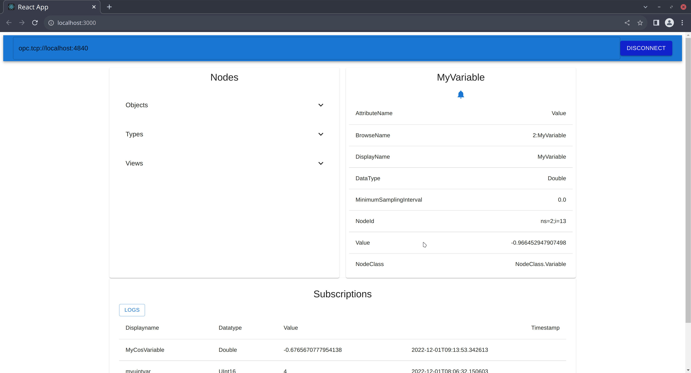

# web-opcua-connector

This repository contains a simple web client for an opcua-server. The user can browse nodes on the server, inspect their attributes and subscribe to them. The difference between this project and other implementations is, that it is a web-application and can run in your browser.

FreeOpcUa offers a non-web open-source implementation for an opcua-client. You can find it [here](https://github.com/FreeOpcUa/opcua-client-gui).

## Setting up the project

Clone/download the project.

The project contains a docker-compose file, which will:

1. build and start the flaskserver in the backend and expose it on port 5000
2. build and start the react frontend and expose it on port 3000

Run the following commands to get the app running inside a docker contaienr:

```
cd existing_repo
docker-compose up
```

If you don't want to run it in a docker-container, first make sure you have python3.10 and node version 16.0. Then change the proxy in the frontend's package.json file to "http://localhost:5000".

You can set up the backend by running:

```
cd into project
pip install -r requirements.txt
flask --app backend run
```

And set up the frontend by running:

```
cd ./frontend
npm install
npm start
```

The backend should run on localhost:5000, the frontend on localhost:3000.

## Description

The project is divided into the frontend and the backend directories.

# backend

The most important part of the backend is the opcua_client.py file. This file contains the actual client for the opcua-server. The backend also contains a flask application, which provides the frontend with an api for interacting with the opcua-client.

# frontend

React application. The user can connect the opcu-client with an opcua-server by specifying the server-url in the connect-bar of the webpage. Once connected, the user can click on various nodes in order to be shown some of their attributes. If the node is a variable, the user can subscribed to it by clicking the bell-icon. The client now gets notified, if there is a datachange in the subscribed node.



## Authors and acknowledgment

This project uses the opcua-asyncua python implementation of the opcua-protocoll by FreeOpcUa.

## License

GNU Lesser General Public License v3.0
